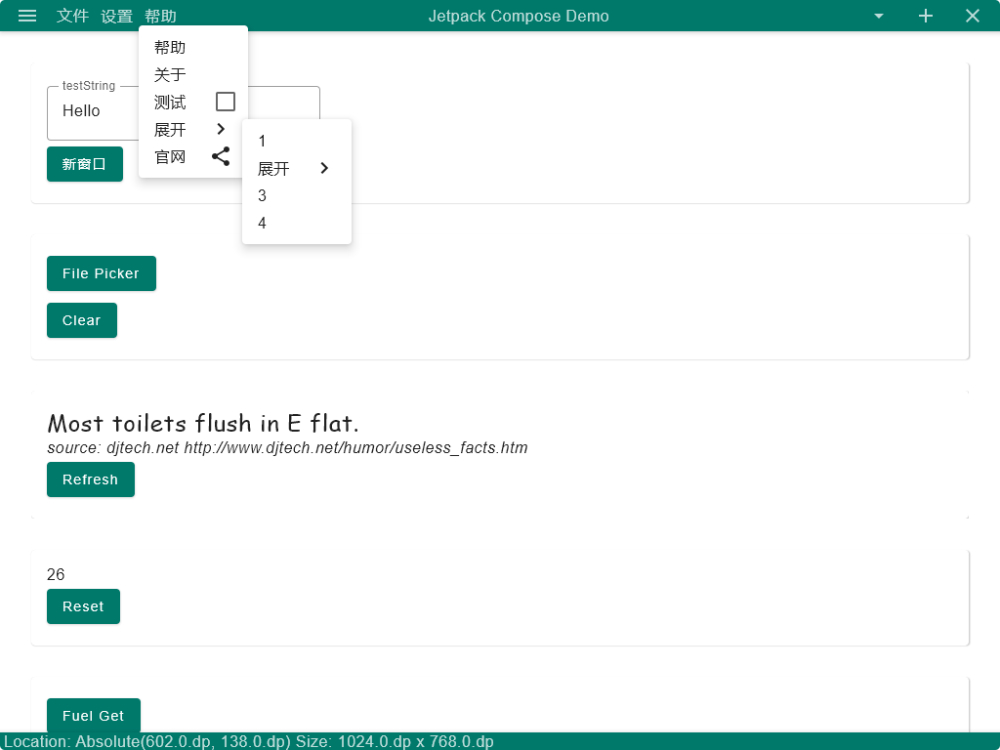

# Jetpack Compose Desktop Demo App

## 引用

本程序使用了以下开源软件:

| 项目                                                                 | 许可                                                                            |
|--------------------------------------------------------------------|-------------------------------------------------------------------------------|
| [Compose Multiplatform](https://www.jetbrains.com/lp/compose-mpp/) | [Apache-2.0](https://github.com/JetBrains/compose-jb/blob/master/LICENSE.txt) |
| [fuel](https://github.com/kittinunf/fuel)                          | [MIT](https://github.com/kittinunf/fuel/blob/master/LICENSE.md)               |

## 版权与许可

Copyright 2022 Winterreisender.

Licensed under GNU Affero General Public License Version 3 (AGPL-3.0-only)

This program is free software: you can redistribute it and/or modify it under the terms of the GNU Affero General Public License as published by the Free Software Foundation, only version 3 of the License.

This program is distributed in the hope that it will be useful, but WITHOUT ANY WARRANTY; without even the implied warranty of MERCHANTABILITY or FITNESS FOR A PARTICULAR PURPOSE. See the GNU Affero General Public License for more details.

You should have received a copy of the GNU Affero General Public License along with this program. If not, see <https://www.gnu.org/licenses/>.

